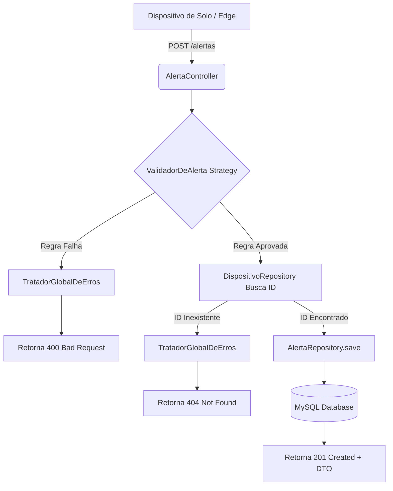

# Space Connect Core API 🚀🌌
### FIAP - Engenharia de Software (3º Ano)
**Global Solution - 2026**

---

## 👥 Integrantes do Grupo (Grupo G3)
* Gilson Dias Ramos Junior - RM552345
* Isabelle Toricelli da Silva - RM552806
* Jeferson Gabriel de Mendonça - RM553149
  
---

## 📝 Motivação e Descrição do Projeto
A **Space Connect Core API** é o motor central de um ecossistema de monitoramento aeroespacial e agrícola de alta precisão. O projeto nasceu da necessidade crítica de mitigar riscos ecológicos e otimizar a segurança de operações em campo. O sistema integra:
1. **Edge Computing / Computação Visual (Dispositivos de Solo - AgroScan):** Câmeras conectadas a microrcontroladores executando algoritmos baseados em OpenCV e Mediapipe para identificar anomalias biológicas em tempo real (ex: focos agressivos de fungos como *Botrytis* em culturas agrícolas).
2. **Telemetria de Órbita (Satélites):** Sensores aeroespaciais que coletam variações meteorológicas críticas, tempestades magnéticas e dados macroclimáticos.

Esta API centraliza esses dados heterogêneos, valida regras críticas de segurança de solo, gerencia o ciclo de vida dos dispositivos e fornece um histórico imutável e auditável de alertas de anomalias com manipulação de tempo precisa.

## 🔗 Vídeo Demostrativo

Neste vídeo, demonstramos o funcionamento prático da Space Connect Core API

👉 https://youtu.be/HqFpGbKdgVc 

---

## 🏛️ Arquitetura de Software e Padrões de Projeto (Design Patterns)
Para cumprir com rigor os critérios arquiteturais exigidos pelo edital, o backend foi construído utilizando as melhores práticas de Engenharia de Software no ecossistema **Spring Boot 3.5.6** e **Java 17+**:

* **Mapeamento de Domínio com Herança JPA (`SINGLE_TABLE`):** A classe abstrata `Dispositivo` serve como matriz para as entidades filhas `Satelite` e `SensorSolo`. Elas são salvas em uma única tabela altamente otimizada (`dispositivos`), diferenciadas automaticamente por uma coluna discriminadora (`tipo_dispositivo`).
* **Polimorfismo Dinâmico:** A classe mãe define o método abstrato `analisarStatusDeRisco()`, cuja assinatura é implementada de forma especializada por cada subclasse para responder conforme o contexto de hardware (via telemetria da NASA ou análise computacional OpenCV).
* **Strategy Pattern com Injeção de Dependência Automática:** Para evitar o acoplamento severo de blocos condicionais (`if/else`) dentro das controladoras, foi desenvolvida a interface `ValidadorDeAlerta`. O Spring Boot injeta dinamicamente em uma lista (`List<ValidadorDeAlerta>`) todas as classes que assinam esse contrato (como o `ValidadorDispositivoAtivo`), executando o motor de validação de forma extensível e isolada.
* **Camada REST Blindada com DTOs (Java Records):** Entidades de banco de dados nunca são expostas ou recebidas cruas pela rede. O fluxo de dados utiliza *Records* imutáveis para transferência de estado, blindando atributos sensíveis e aplicando restrições do Bean Validation (`@NotBlank`, `@NotNull`).
* **Escudo Global de Exceções (`@RestControllerAdvice`):** Captura interceptiva centralizada de falhas de negócio. Erros comuns de requisição incorreta de campos disparam o código HTTP `400 Bad Request` com relatórios limpos; buscas a chaves primárias inexistentes são tratadas de forma transparente como `404 Not Found`.
* **Versionamento de Banco de Dados Autônomo (Flyway):** Ciclo estruturado e versionado via scripts SQL automáticos na inicialização para garantir a integridade entre o ambiente de desenvolvimento local e os pipelines de produção.

---

## 🛠️ Tecnologias Utilizadas
* **Java 17** (Linguagem Principal)
* **Spring Boot 3.5.6** (Framework Core)
* **Spring Data JPA** (Persistência e Mapeamento ORM)
* **Hibernate Core** (Mecanismo Interno ORM)
* **Flyway Migration** (Versionamento de Schema SQL)
* **MySQL Connector/J** (Driver de Banco de Dados)
* **Jakarta Validation API** (Validação de Restrições de DTOs)
* **Lombok** (Eliminação de Boilerplate Code)
* **Springdoc OpenAPI UI 2.7.0** (Documentação Gráfica e Interativa via Swagger)

---

## 🔀 Endpoints da API (Matriz de Rotas REST)

### 🔐 Autenticação e Segurança (JWT)
A API está protegida pelo **Spring Security** com autenticação **Stateless via Token JWT (JSON Web Token)**.

| Verbo | Rota | Descrição | Payload (JSON) | Status Sucesso | Status Erro Esperados |
| :--- | :--- | :--- | :--- | :--- | :--- |
| **POST** | `/login` | Autentica um utilizador e devolve o Token JWT. | `{"login": "admin@gmail.com", "senha": "123456"}` | **200 OK** | `403 Forbidden` |

**Como testar no Swagger:**
1. Execute o endpoint `POST /login` com as credenciais padrão informadas acima (que são criadas automaticamente pela migration `V2`).
2. Copie o token devolvido na resposta.
3. Suba até ao topo da página do Swagger, clique no botão **"Authorize"** (ícone de cadeado) e cole o token.
4. A partir desse momento, todas as rotas (Alertas e Dispositivos) estarão desbloqueadas para os seus testes!

### 🚨 Gerenciamento de Alertas (`/alertas`)

| Verbo | Rota | Descrição | Payload (JSON) / Parâmetros | Status Sucesso | Status Erro Esperados |
| :--- | :--- | :--- | :--- | :--- | :--- |
| **POST** | `/alertas` | Registra um alerta de anomalia crítica validando o estado do dispositivo. | `{"descricao": "string", "gravidade": "ALTA", "idDispositivo": 1}` | **201 Created** | `400 Bad Request` (Inativo/Campos nulos)<br>`404 Not Found` (ID inválido) |
| **GET** | `/alertas` | Lista todas as ocorrências de anomalias espaciais/agrícolas registradas. | Nenhum | **200 OK** | Nenhum |
| **PUT** | `/alertas` | Atualiza os metadados de descrição e severidade de um alerta existente. | `{"id": 1, "descricao": "Nova descrição", "gravidade": "CRITICA"}` | **200 OK** | `404 Not Found` (ID inexistente) |
| **PUT** | `/alertas/{id}/resolver` | Executa o fechamento do ciclo de vida do evento preenchendo o histórico com LocalDateTime real. | ID na URL (`/alertas/1/resolver`) | **200 OK** | `404 Not Found` (ID inexistente) |
| **DELETE** | `/alertas/{id}` | Realiza a remoção/exclusão física permanente do registro de alerta do banco. | ID na URL (`/alertas/1`) | **204 No Content**| `404 Not Found` (ID inexistente) |

### 📡 Gerenciamento de Dispositivos (`/dispositivos`)

| Verbo | Rota | Descrição | Payload (JSON) / Parâmetros | Status Sucesso | Status Erro Esperados |
| :--- | :--- | :--- | :--- | :--- | :--- |
| **POST** | `/dispositivos` | Cadastra novos equipamentos polimórficos (Satélite ou SensorSolo). | `{"tipo": "SATELITE", "nome": "X", "localizacao": "Y", "orbita": "Z"}` | **201 Created** | `400 Bad Request` (Campos obrigatórios vazios) |
| **GET** | `/dispositivos` | Lista todos os equipamentos físicos e orbitais do projeto. | Nenhum | **200 OK** | Nenhum |
| **PUT** | `/dispositivos` | Altera dinamicamente os parâmetros operacionais ou localização de um equipamento. | `{"id": 2, "nome": "Novo Nome", "localizacao": "Nova Localização"}` | **200 OK** | `404 Not Found` (ID incorreto) |
| **DELETE** | `/dispositivos/{id}` | Executa a exclusão lógica (Inativação operacional do dispositivo - `ativo = false`). | ID na URL (`/dispositivos/2`) | **204 No Content**| `404 Not Found` (ID incorreto) |

---

## 🚀 Guia de Execução Local da Aplicação

### 1. Pré-requisitos
* Java JDK 17 instalado e configurado nas variáveis de ambiente.
* Maven 3.x+ ou utilização do wrapper embarcado (`./mvnw`).
* Servidor MySQL ativo localmente.

### 2. Configuração do Banco de Dados
Abra o seu client MySQL de preferência (MySQL Workbench, DBeaver, Command Line) e crie o schema casca vazio do projeto:
```sql
CREATE DATABASE space_connect_db;
```

## 3. Ajuste de Credenciais da Aplicação
Navegue até o arquivo src/main/resources/application.properties e atualize as credenciais de acesso locais do seu banco de dados:
```java
spring.datasource.url=jdbc:mysql://localhost:3306/space_connect_db
spring.datasource.username=seu_usuario_root
spring.datasource.password=sua_senha_local
```

## 4. Compilação e Execução
Na raiz do projeto (onde reside o arquivo pom.xml), execute os comandos de limpeza e compilação do Maven para baixar as dependências e subir a aplicação:

No terminal Windows:
```
mvn clean install
mvn spring-boot:run
```

No terminal Linux/macOS:
```
./mvnw clean install
./mvnw spring-boot:run
```

O Flyway detectará a inicialização limpa e executará automaticamente a criação das tabelas e a inserção dos dados padrão de simulação de hardware (seed). A aplicação estará ativa assim que o console exibir a linha:
Tomcat started on port 8080 (http) with context path '/'

---

## 🔍 5. Acesso à Interface de Testes (Swagger)
Abra qualquer navegador de internet moderno e acesse a URL da central gráfica de documentação interativa:

👉 http://localhost:8080/swagger-ui.html

Através do Swagger, você poderá testar todas as validações de barramento de dispositivos inativos, registrar alertas, resolver eventos de anomalia climática/biológica e acompanhar o comportamento estável da engenharia de software da aplicação.

---

## 📊 Diagrama de Fluxo (Cadastro de Anomalia)
Abaixo está o fluxo arquitetural de como um alerta é processado e validado pela API:


